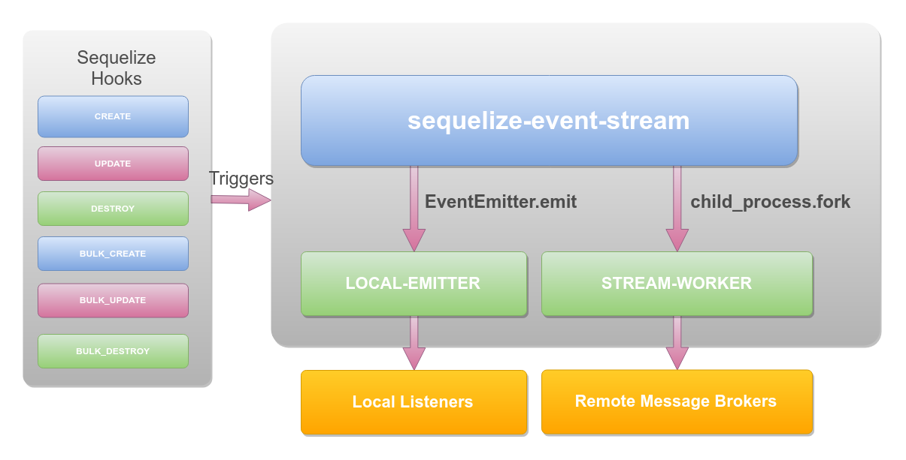

# sequelize-event-stream
## *WORK IN PROGRESS :D* 
[](https://www.npmjs.com/package/sequelize-event-stream)
[](https://travis-ci.org/mvillarrealb/sequelize-event-stream)
[](https://codecov.io/gh/mvillarrealb/sequelize-event-stream)

[](https://github.com/mvillarrealb/sequelize-event-stream/blob/master/LICENSE)

Event publishing capabilities for your sequelize's models using hooks.

**sequelize-event-stream** adds a sugaring layer to your database connection, listening for every transactional event in sequelize.



The architecture works as follows:

The sequelize event stream is attached to your sequelize's instance, it will listen for every supported hook. Supported hooks are:

* afterCreate
* afterUpdate
* afterDestroy
* afterBulkCreate
* afterBulkUpdate
* afterBulkDestroy

Once fired one of the listed hooks it will use a eventWorker configuration to send your message as an event to a queue/topic from the supported brokers.

# Supported Sinks

* Rabbitmq
* Kafka
* Amazon SQS

# Installation

```bash
npm install --save sequelize-event-stream
```

# Documentation

You can check the full [documentation](https://mvillarrealb.github.io/sequelize-event-stream/) to view full usage of this module.

## Run all tests

To run all unit and integration tests:

```bash
npm test
```

## Run unit tests only

To run the unit tests use the following command:

```bash
npm run unit-test
```

## Run integ tests only

To run the integration tests use the following command:

```bash
npm run integ-test
```

# Generate ESDOC Documentation

To geneate the ESDOC documentation use the following command:

```bash
npm run docs
```

# Running the coverage

To run the coverage report use the following command
```bash
npm run coverage
```